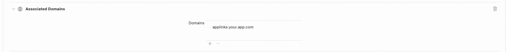

# 快手开放平台SDK

# 一、设计目标

开放平台sdk的设计目标是：第三方应用使用开放平台sdk能够方便、快速的调起快手主app的功能页面，从而将第三方内容发布到快手平台上或者使用快手APP提供的其他开放功能。

| 开放能力 |                   |                  |                  |            |            |                |              |          |
| -------- | ----------------- | ---------------- | ---------------- | ---------- | ---------- | -------------- | ------------ | -------- |
| 账号授权 | 快手App授      权 | 快手极速版授权   |                  |            |            |                |              |          |
| 社交功能 | 分享私信          | 分享私信到指定人 | 打开指定用户主页 |            |            |                |              |          |
| 生产功能 | 单图编辑          | 单图发布         | 单视频编辑       | 单视频裁剪 | 单视频发布 | 多视频图片裁剪 | 智能裁剪视频 | 多图编辑 |

# 二、项目地址库

准备工作
开发者需要在快手开放平台完成注册，新建一个网站应用，并获取应用标识appId 和 appSecret，详细参考[申请注册流程](https://open.kuaishou.com/platform/openApi?menu=7)，官网地址：https://open.kuaishou.com/platform
demo地址：https://github.com/KwaiSocial/KwaiSDK-iOS

# 三、接入说明

假定当前待接入应用信息为:     
网站域名: https://your.app.com/   
应用 TeamId:  8P7343TG54  
应用 Bundle Identifier: com.company.app  
应用 快手appId: ks685673047210945076   

## 1.配置您应用的UniversalLinks

由于苹果iOS 13系统版本安全升级，为此openSDK在3.0.0版本进行了适配。 3.0.0版本支持Universal Links方式跳转，对openSDK分享进行合法性校验。

### **（1）根据 [苹果文档](https://developer.apple.com/documentation/uikit/inter-process_communication/allowing_apps_and_websites_to_link_to_your_content) 配置你应用的Universal Links：**

快手对Universal Links要求：必须支持HTTPS，配置的paths不能带query参数，App配置的paths必须加上通配符/*，

并且配置到快手的Universal Links需要以"/"结尾，便于快手SDK拼接参数能够正常完成跳转。

apple-app-site-association内容示例:  

```json
{
    "applinks": {
        "apps": [],
        "details": [
            {
                "appID": "8P7343TG54.com.company.app",    
                "paths": ["/specialPath/*"]
            },
            {
                "appID": "8P7343TG54.com.company.app2",
                "paths": [ "*","/app2/*" ]
            },
        ]
    }
}
```

### **（2）打开Associated Domains开关，将Universal Links域名加到配置上**



### **（3）验证您的Universal Links是否生效**

Safari输入Universal Links(包括完整路径)+随机字符串(例如: abc)

举例：

根据您网站apple-app-site-association文件所示, 快手网站注册及代码中使用的Universal Links应为  

```tex
https://your.app.com/sdksample/
```

Safari输入以下url进行测试:

```tex
https://your.app.com/sdksample/abc
```

检查是否存在跳转提示或可直接跳转至您的App

## 2.搭建开发环境

### 2.1 集成静态库

#### (1) 通过cocoapods集成

```ruby
pod 'KwaiSDK' ,'3.7.1.11'
```

#### (2) 手动集成

1.在 XCode 中建立你的工程。

2.将 SDK 文件中 KwaiSDK.framework 文件添加到你所建的工程中。

3.开发者需要在工程中链接上:**WebKit.framework**。

4.在你的工程文件中选择 Build Setting，在"Other Linker Flags"中加入"-ObjC -all_load"。


### 2.2 设置scheme

在 Xcode 中，选择你的工程设置项，选中“TARGETS”一栏，在“info”标签栏的“URL type“添加“URL scheme”为你所注册的应用程序 id（如下图所示）。


在Xcode中，选择你的工程设置项，选中“TARGETS”一栏，在 “info”标签栏的“LSApplicationQueriesSchemes“添加 **kwai kwaiAuth2 kwaiopenapi KwaiBundleToken kwai.clip.multi KwaiSDKMediaV2 ksnebula**

在实际开发中，需要把示例例中的 **ks685673047210945076** 替换成⾃己的 **appId**

### 2.3 使用开发工具包所需配置

#### (1) 要使你的程序启动后快手终端能响应你的程序，必须在代码中向快手终端注册你的 id。（如下图所示，在 AppDelegate 的 didFinishLaunchingWithOptions 函数中向快手注册 id）。

```objc
- (BOOL)application:(UIApplication *)application didFinishLaunchingWithOptions:(NSDictionary *)launchOptions {
    //向快手注册
    [KSApi registerApp:APP_ID universalLink:UNIVERSAL_LINK delegate:YOUR_DELEGATE];
    return YES;
}
```


#### (2) 重写 AppDelegate 的 handleOpenURL 和 openURL 方法：

```objc
- (BOOL)application:(UIApplication *)application handleOpenURL:(NSURL *)url {
    return [KSApi handleOpenURL:url];
}

- (BOOL)application:(UIApplication *)application openURL:(NSURL *)url sourceApplication:(NSString *)sourceApplication annotation:(id)annotation {
    return [KSApi handleOpenURL:url];
}

- (BOOL)application:(UIApplication *)app openURL:(NSURL *)url options:(NSDictionary<UIApplicationOpenURLOptionsKey, id> *)options {
    return [KSApi handleOpenURL:url];
}
```


#### (3) 重写AppDelegate或SceneDelegate的continueUserActivity方法。

**注意：适配了SceneDelegate的App，系统将会回调SceneDelegate的continueUserActivity方法，所以需要重写SceneDelegate的该方法。**

AppDelegate:

```objc
- (BOOL)application:(UIApplication *)application continueUserActivity:(nonnull NSUserActivity *)userActivity restorationHandler:(nonnull void (^)(NSArray<id<UIUserActivityRestoring>> * _Nullable))restorationHandler {
    return [KSApi handleOpenUniversalLink:userActivity];
}
```

SceneDelegate:

```objc
- (void)scene:(UIScene *)scene continueUserActivity:(NSUserActivity *)userActivity {
    return [KSApi handleOpenUniversalLink:userActivity];
}
```

##### 3.重写AppDelegate或SceneDelegate的continueUserActivity方法。

**注意：适配了SceneDelegate的App，系统将会回调SceneDelegate的continueUserActivity方法，所以需要重写SceneDelegate的该方法。**

AppDelegate:

```objc
- (BOOL)application:(UIApplication *)application continueUserActivity:(nonnull NSUserActivity *)userActivity restorationHandler:(nonnull void (^)(NSArray<id<UIUserActivityRestoring>> * _Nullable))restorationHandler {
    return [KSApi handleOpenUniversalLink:userActivity];
}
```

SceneDelegate:

```objc
- (void)scene:(UIScene *)scene continueUserActivity:(NSUserActivity *)userActivity {
    return [KSApi handleOpenUniversalLink:userActivity];
}
```

## 3.快手授权使用说明
快手、极速版授权登陆

```objc
KSAuthRequest *req = [[KSAuthRequest alloc] init];
///取决于你的app需要的快手用户权限，应当与注册到快手开放平台的权限匹配。
req.scope = @"user_info";
// 设置当前request期望使用的快手体系终端，支持的终端见KSApiApplication
// 数组内可以设置一个或多个KSApiApplication，SDK内部会按照顺序优先使用可用的终端，若数组为空或不设置则默认使用快手App
// 目前仅授权登陆KSAuthRequest可以生效
req.applicationList = @[];

//当用户设备未安装快手终端的时候，会在这个传入的viewController present出一个H5页面，可以让用户输入手机号&验证码方式登陆快手账号。如果为空并且用户设备未安装快手终端会回调error给delegate。
req.h5AuthViewController = YOURE_VC;

[KSApi sendRequest:req completion:^(BOOL success) {
	// 请求回调
}];
```

## 4.分享视频、分享消息到快手
### (1)分享H5卡片消息到快手
分为指定用户和非指定用户发送两种方式：

指定用户发送：跳转主app后弹出一个卡片窗口，可增加H5卡片消息附言，确认后发送并跳转到单聊界面，仅双关用户可发送成功。

非指定用户发送：跳转主app后present出一个用户选择列表，有群组，可多选，可增加H5卡片消息附言，确认后发送并跳转到聊天session列表页面。

```objc
KSShareWebPageObject *object = [[KSShareWebPageObject alloc] init];
//H5卡片消息的标题
object.title = @"title";
//H5卡片消息的描述
object.desc = @"desc";
//H5卡片消息点击跳转url
object.linkURL = @"url";
//H5卡片消息的icon
object.thumbImage = UIImageJPEGRepresentation(YOURE_IMAGE, 1);

KSShareMessageRequest *req = [[KSShareMessageRequest alloc] init];
//发送方的openId，如果指定receiverOpenID了，那么openID为空会报错，因为在指定接收用户的场景下，需要发送方的id去校验用户关系
req.openID = [self selfOpenID];
//目前仅支持KSShareScopeSession
req.shareScene = KSShareScopeSession;
//目前仅支持KSShareWebPageObject
req.shareObject = object;
//接收方的openId，如果不指定，即非指定用户发送，则跳转到快手终端后会展示用户列表，在快手终端中自行选择接收方。
req.receiverOpenID = TARGET_OPEN_ID;
[KSApi sendRequest:req completion:nil];
```

### (2)打开指定用户主页
```objc
KSShowProfileRequest *req = [[KSShowProfileRequest alloc] init];
//跳转的目标用户openID
req.targetOpenID = [self targetOpenID];
[KSApi sendRequest:req];
```
### (3) 生产功能

```objc
KSShareMediaObject *mediaItem = [[KSShareMediaObject alloc] init];
//建议为NO, 即执行兜底逻辑，无相关发布权限时进入预裁剪页
mediaItem.disableFallback = NO;
//暂不对外开放，不要用
mediaItem.extraEntity = nil;
//发快手关联的标签
mediaItem.tags = @[];

//选择发布的封面图片
mediaItem.coverAsset = thumbnail;
//选择发布的素材，图片，视频，多段视频等，需要与mediaFeature相符
mediaItem.multipartAssets = shareItems;

//从快手11.3.20版本之后，支持在发布页，除了KSShareMediaFeature_AICut类型之外，挂载关联小程序。发布之后，会展示关联的小程序。sdk版本需要>=3.7.1
KSMediaAssociateKWAppObject *associateObject = [[KSMediaAssociateKWAppObject alloc] init];
//关联小程序名称
object.title = @"text";
//关联小程序id
object.kWAppId = @"text";
//关联的小程序,点开挂件跳转的路径，默认小程序首页
object.kWAppPath = @"text";

//关联的挂件类型，目前仅支持KSMediaAssociateKWApp小程序类型
mediaItem.associateType = KSMediaAssociateKWApp;
mediaItem.associateObject = associateObject;

KSShareMediaRequest *request = [[KSShareMediaRequest alloc] init];

//目前支持一下类型
//KSShareMediaFeature_Preprocess ///< 裁剪功能
//KSShareMediaFeature_VideoEdit ///< 视频编辑功能，该能力需要申请权限
//KSShareMediaFeature_PictureEdit ///< 图片编辑功能
//KSShareMediaFeature_VideoPublish ///< 视频发布功能，该能力需要申请权限
//KSShareMediaFeature_AICut ///< 智能裁剪功能
request.mediaFeature = shareMedia.feature;
request.mediaObject = mediaItem;
__weak __typeof(self) ws = self;
[KSApi sendRequest:request completion:^(BOOL success) {
	__strong __typeof(ws) ss = ws;
	[ss logFormat:@"%s success: %@", __func__, success ? @"YES" : @"NO"];
	completion ? completion(success) : nil;
}];
```

# 四、FAQ
## 1、出现任何问题排查流程
```
1. 请检查 SDK接入配置 是否缺少配置；到应用市场升级最新的快手App。
2. 请检查下载的SDK包里面的所有文件是否都引入并配置到了开发者的工程里。
3. 在demo 内测试接入的功能是否正常。
4. 若运行 demo 正常，仔细对比demo和开发者工程的集成逻辑的区别。
5. 若还是不行，提供快手App信息、开发者信息找人工客服，会有专业人员接收问题。
```
## 2、快手外部应用app分享视频时如何插入话题。

```
目前对外的opensdk不支持发布视频时带话题标签。另外extraInfo，thirdExtraInfo，mediaInfoMap这些字段暂不对外开放。
```

## 3、100200101排查操作手册
这个错误的原因是app 非法，例如 开发者不存在，app 不存在或状态不正确等
```
建议用户使用SDK 版本大于3.6.5，3.6.5以下版本可能存在bundleToken不刷新问题
```
如依然存在问题，请按找以下步骤依次排查。
1. 首先确认是否按照以下步骤配置工程
https://open.kuaishou.com/platform/openApi?menu=9
https://developer.apple.com/documentation/xcode/supporting-associated-domains
2. 检查跳转到快手以及跳转到您的App的universal link 是否可用

	a. 是否可正常打开快手
safari中地址栏填入: https://m.ssl.kuaishou.com/app/openapi

	是否出现在快手app中打开的banner

	若无入口，可能是由于系统拉取快手Universal Links失败，请检查手机网络状态是否正常，或更新/重装快手
	
	b.是否可正常打开您的程序

	safari中地址栏填入您的跳转服务网址。是否出现跳转到您的App中打开的banner
	
	若无入口
	
	①检查是否正常配置了universal link，
	
	②检查服务器apple-app-site-association文件，
	
	③检查程序内Associated Domains字段是否添加了相关Domains，
以上若配置正常，则可通过safari打开。
3. 检查是否登记信息一致
	打开您的登记页(https://open.kuaishou.com/platform)和您的注册代码，检查是否一致
4. 检查信息是否生效
   	卸载快手，使用h5登录，判断 appid, 是否有登录权限.如能够正常登录，表示权限配置正确。

# 五、错误码

|错误码	|说明	|备注|
|---|---|----|
|-1	|内部问题，联系客服	||
|1	|分享成功	||
|-1005|	没有安装快手App	||
|-1006|	不支持此功能	||
|-1010|	参数传递失败| |
|1001	|传入的参数不符合预定	||
|1002	|分享需要降级，但是没有打开降级开关||
|1003	|快手App没有图片读取权限	||
|1004	|快手App开着青少年模式，关闭即可||
|1005	|视频size太大	||
|10001	|快手认证服务端数据异常	||
|20094|	openId不存在	||

